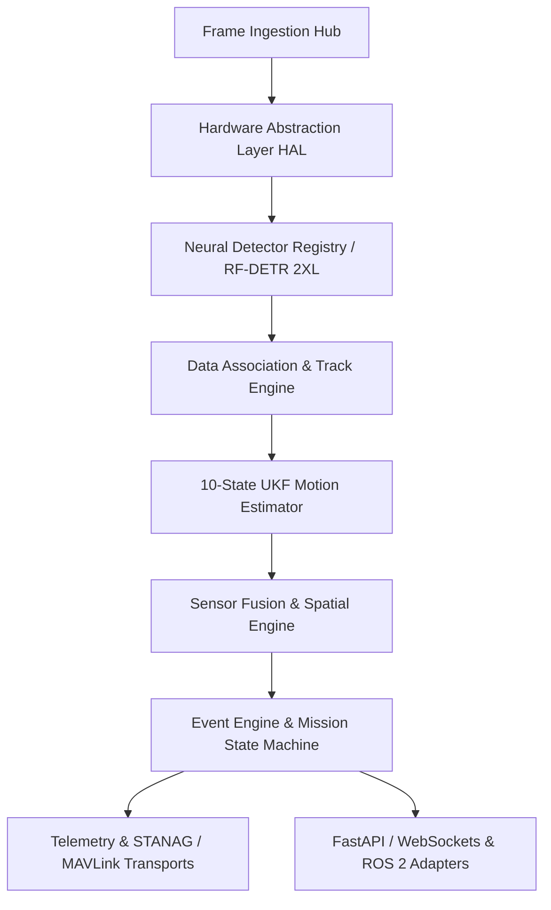

# APEX-Track Architecture Specification

## 1. System Overview

APEX-Track is an industrial-grade, zero-latency AI perception, object identification, target tracking, telemetry fusion, and situational-awareness platform. It is engineered for heterogeneous execution across high-performance desktop GPUs, NVIDIA Jetson Orin NX, Raspberry Pi 5 edge devices, simulated environments, and distributed multi-machine nodes.

The core platform remains technology-agnostic: detectors, trackers, sensors, cameras, telemetry transports, storage backends, and UI clients exist behind clean, strongly-typed domain interfaces.

---

## 2. Key Subsystems & Layers

### 2.1 Domain Layer (`apex.engine.contracts`)
- **Strict Data Contracts**: `Frame`, `Detection`, `BoundingBox`, `Track`, `Telemetry`, `Event`, and `Command`.
- **Zero-Vendor-Leakage**: Domain contracts do not import OpenCV, PyTorch, TensorRT, ROS 2, or MAVLink types.

### 2.2 Runtime & Event System
- **Message Bus (`apex.engine.bus`)**: Typed async pub/sub bus with fnmatch wildcard channel filtering, queue backpressure handling, and non-blocking worker queues.
- **Global State Machine (`apex.engine.state`)**: Lifecycle transitions (`BOOTING`, `INITIALIZING`, `READY`, `RUNNING`, `DEGRADED`, `PAUSED`, `RECONFIGURING`, `ERROR`, `SHUTTING_DOWN`, `STOPPED`).
- **Event Engine (`apex.engine.events`)**: Severity-graded event publishing with correlation IDs and rolling audit logs.

### 2.3 Hardware Abstraction Layer (`apex.engine.hal`)
- **Capability Model**: Discovers CPU cores, RAM limits, CUDA availability, VRAM, TensorRT support, and recommended precision (`fp16`/`fp32`).
- **Hardware Profiles**: Pre-tuned capability profiles for Desktop RTX, Jetson Orin NX, Raspberry Pi 5, and CPU-only environments.

### 2.4 Perception Engine
- **Detector Abstraction & Registry**: Pluggable detector interface. Primary high-accuracy detector: **RF-DETR 2XL** (with PML-1.0 license compliance validation), alongside RT-DETR, RTMDet, and YOLOv11 options.
- **Tracker Abstraction**: Modular tracking engine supporting ByteTrack and BoT-SORT Camera Motion Compensation (CMC).
- **10-State Unscented Kalman Filter (UKF)**: Dedicated 10-state state estimation (`x, y, z, vx, vy, vz, ax, ay, az, turn_rate`) decoupling motion state estimation from detection and data association.

### 2.5 Telemetry & Connectivity
- **Transport Adapters**: MAVLink UDP (e.g. `udp:0.0.0.0:14550`), STANAG 4609 metadata stream parser, ROS 2 node adapter (`apex_track_ros`), and WebSocket 30 Hz streaming server.

### 2.6 Spatial Analytics & Mission Management
- **3D World Coordinate Projection**: Sensor geometry transformation mapping 2D pixel observations to 3D world coordinates.
- **Geofence Engine**: Automated 3D breach detection, threat matrix scoring, and mission lifecycle management.
- **Black-Box Recorder**: Asynchronous JSONL event logging and raw/HUD video recording.

---

## 3. License & Compliance Architecture
- Core system code: **Apache 2.0**
- RF-DETR 2XL weights & model extensions: **PML-1.0** (requires explicit license acceptance flag `accept_pml1_license=True`)
- AGPL plugins (e.g. Ultralytics YOLOv11): Gated by `accept_agpl_plugins=True` setting.
